# Проект по автоматизации тестирования API для сайта по изучению английского языка Lingualeo
## <a target="_blank" href="https://lingualeo.com/ru">Веб сайт Lingualeo</a>


## :rocket: Содержание:

- [x] <a href="#rocket-технологии-и-инструменты">Технологии и инструменты</a>
- [x] <a href="#rocket-реализованные-проверки">Реализованные проверки</a>
- [x] <a href="#rocket-сборка-в-Jenkins">Сборка в Jenkins</a>
- [x] <a href="#rocket-запуск-из-терминала">Запуск из терминала</a>
- [x] <a href="#rocket-allure-отчет">Allure отчет</a>
- [x] <a href="#rocket-интеграция-с-allure-testops">Интеграция с Allure TestOps</a>
- [x] <a href="#rocket-интеграция-с-jira">Интеграция с Jira</a>
- [x] <a href="#rocket-отчет-в-telegram">Отчет в Telegram</a>

## :rocket: Технологии и инструменты
<p align="center">


</p>

## :rocket: Реализованные проверки это смоук тесты

- Проверка тематического блока с использованием junit 
- Проверка тематического блока с помощью регулярных выражений 
- Проверка блока грамматики с помощью junit 
- Проверка блока грамматики с использованием регулярных выражений 
- Проверка ключевых значений 
- Соответствие схеме Json 
- Проверка вывода музыкального блока 
- Проверка вывода музыкального блока с недопустимыми значениями 
- Активация промокода с недопустимым значением

## :rocket: Сборка в Jenkins
### <a target="_blank" href="https://jenkins.autotests.cloud/job/LingualeoApiTestsRustam/">Сборка в Jenkins</a>
<p align="center">
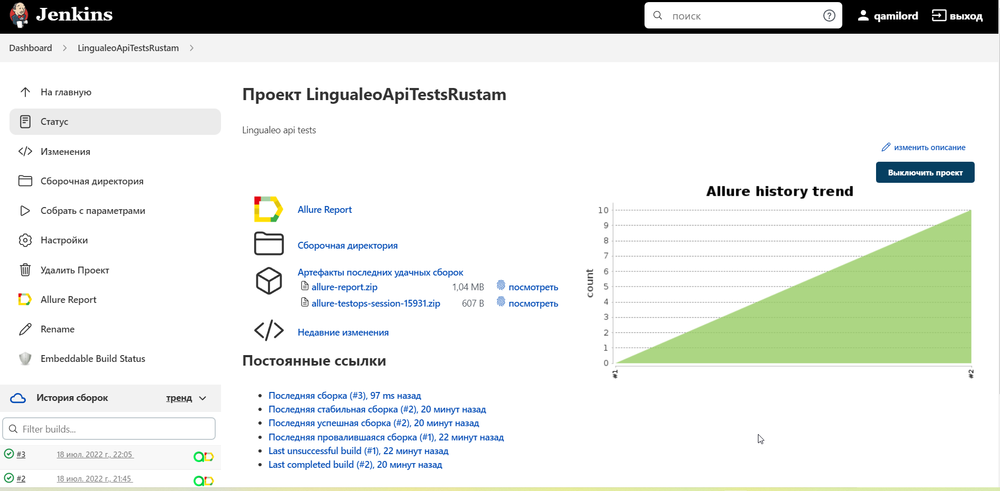
</p>

### Параметры сборки в Jenkins:
Сборка в Jenkins

- task (выбор таски)
- threads (количество потоков)

## :rocket: Запуск из терминала
Локальный запуск:
```
gradle clean test - общий запуск тестов
gradle clean tabs - запуск блока вкладок
gradle clean search - запуск блока поиска
gradle clean activation - запуск блока активации
```

Удаленный запуск:
```
clean
${TASK}
```

## :rocket: Allure отчет
- ### Главный экран отчета
<p align="center">
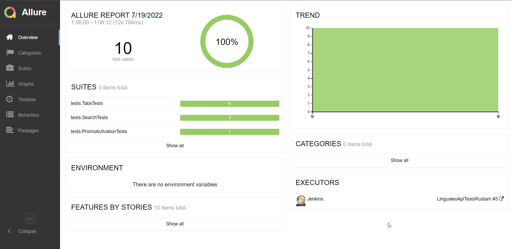
</p>

- ### Страница с проведенными тестами (suites)
<p align="center">
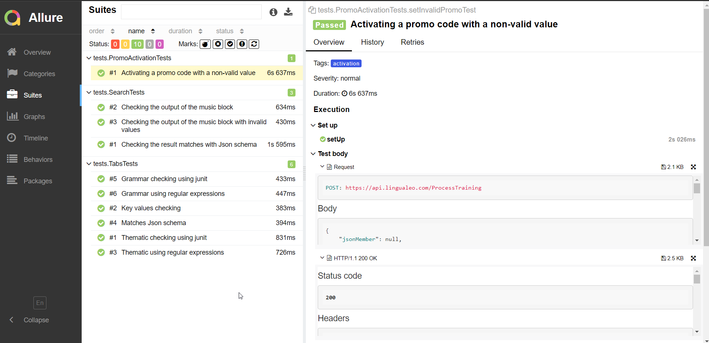
</p>

- ### Страница с пакетами тестов
<p align="center">
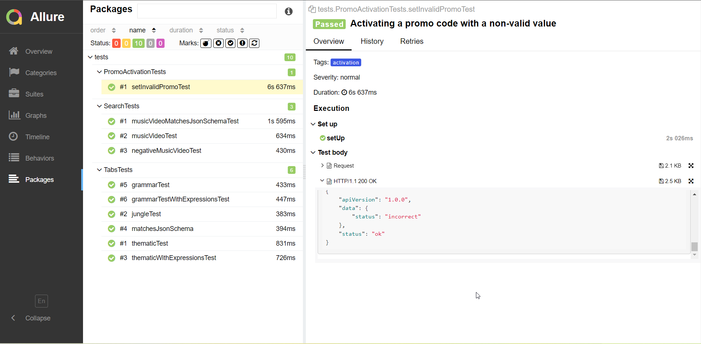
</p>

- ### Страница с графиком прохождения тестов
<p align="center">
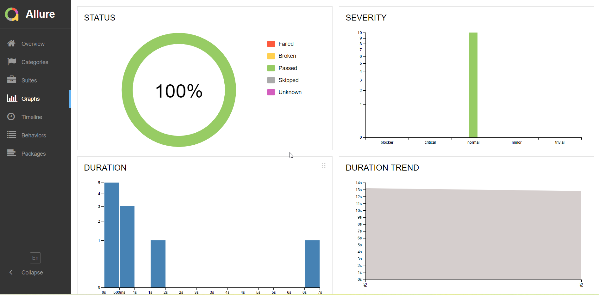
</p>

## :rocket: Интеграция с Allure TestOps
- ### Экран с результатами запуска тестов
<p align="center">
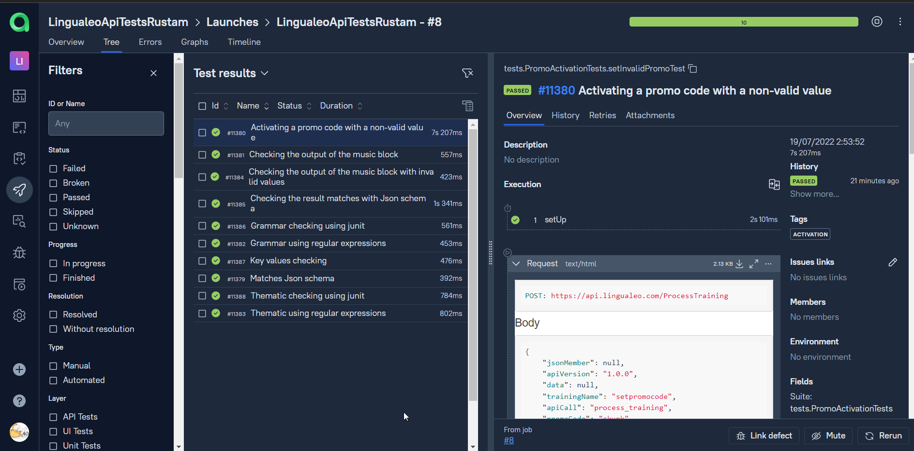
</p>

- ### Экран с launches после интеграции с IDE + график
<p align="center">
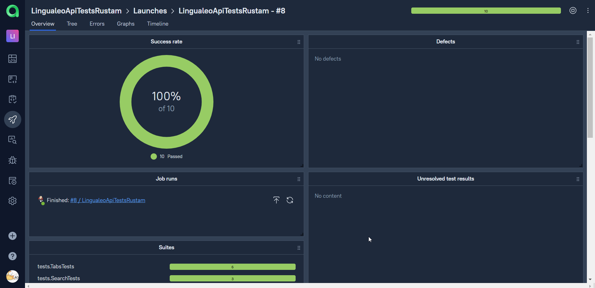
</p>

- ### Экран с дашбордами и тестами в TestOps auto + manual
<p align="center">
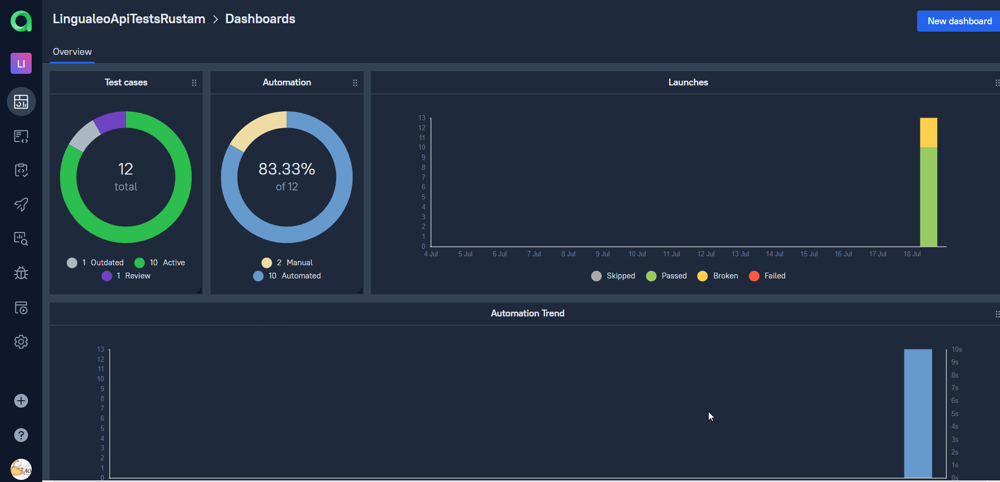
</p>

- ### Страница с тест кейсами в TestOps
<p align="center">
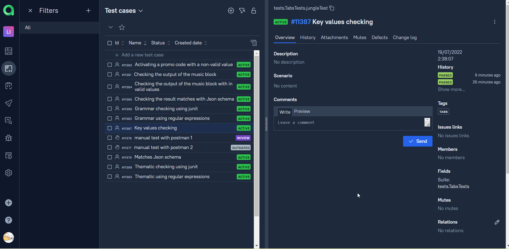
</p>

- ### Страница с тест ранами в TestOps auto + manual
<p align="center">
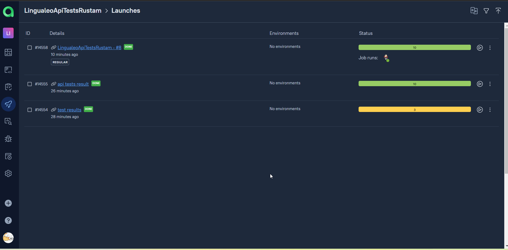
</p>

## :rocket: Интеграция с Jira
- ### Страница с задачей в Jira
<p align="center">
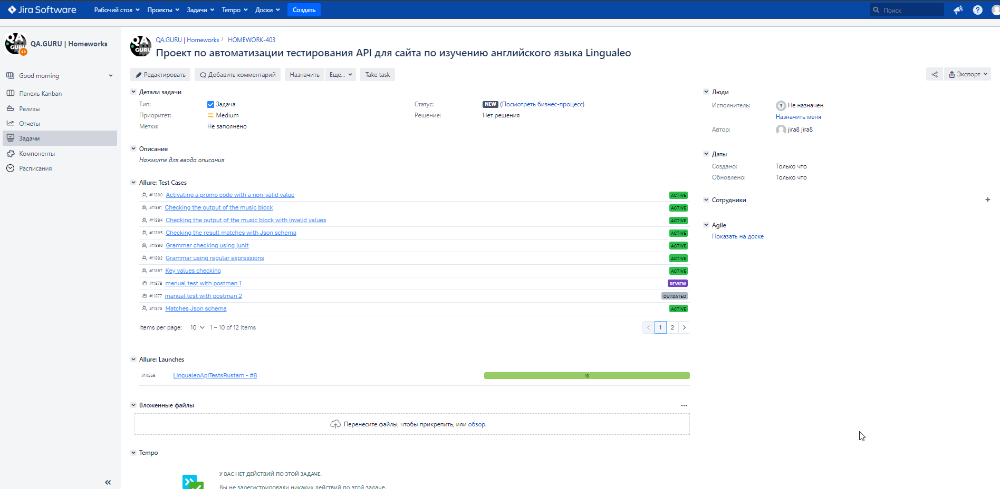
</p>

## :rocket: Отчет в Telegram
<p align="center">
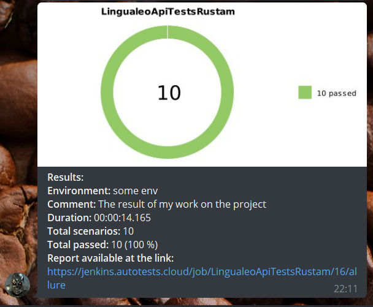
</p>

Локальный запуск:
```
java "-DconfigFile=notifications/telegram.json" -jar allure-notifications-4.2.0.jar

```


